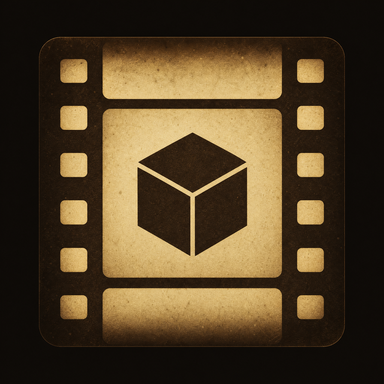

# Valtique

**Version:** v5.4.1

Valtique is a mobile-first CRT/VHS post-processing shaderpack for Iris. It
combines letterbox framing, tube-screen curvature, analog signal instability,
and lightweight phosphor afterimage effects without compute shaders or a
shadow pass.

## Features
- Warm low-resolution halation for bright highlights
- VHS signal mode with horizontal jitter, tracking band, tape dropout, and hold-slip
- CRT color convergence, interlaced scanline roll, and barrel curvature
- Quarter-resolution phosphor persistence for moving highlights
- Natural old-CRT defaults with subtle scanlines, phosphor glow, edge convergence, and restrained VHS instability
- Potato Mode enabled by default for mobile launchers and low-end devices
- Optional film damage, outline, and fog controls

## Installation
1. Move the `Valtique` file into `.minecraft/shaderpacks/`
2. Select this shaderpack in Iris (Options → Video Settings → Shader Packs)
3. Open "Shader Pack Settings" and leave `POTATO_MODE` on for low-end mobile hardware.
4. Disable `POTATO_MODE` only on stronger hardware to enable full film damage,
   VHS hold-slip, dropout, and wider halation sampling.

## Compatibility
- Written and verified against official Iris documentation (GLSL 330
  compatibility profile, standard uniforms: colortex0, depthtex0, viewWidth,
  viewHeight, frameTimeCounter, near, far)
- Includes explicit gbuffers programs (terrain, sky, basic, textured, water)
  to prevent Iris from auto-reconstructing vanilla shaders with built-in fog.
- Uses only GLSL 330 fragment/vertex passes; it does not require compute shaders.
- Mobile launcher support is a performance target, not a guarantee: final FPS and
  compatibility still depend on the Android GPU, translation layer, Iris version,
  render distance, and installed mods.

## Credit
Zaineedyou

- GitHub: https://github.com/Zaineedyou
- Discord: https://discord.com/users/1133016364857180301
- Website: https://claudia.web.id

## License
This shaderpack's outline detection logic is copied from Complementary
Shaders and is subject to the Complementary Agreement 1.3. See
`COMPLEMENTARY_LICENSE.txt` (included in this pack) for the full text.

All other code in this shaderpack is original work, licensed under
Creative Commons Attribution-NoDerivatives 4.0 International (CC BY-ND 4.0).
See `LICENSE.txt` (included in this pack) for the summary, or
https://creativecommons.org/licenses/by-nd/4.0/ for the full legal code.
